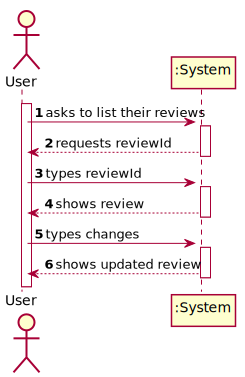
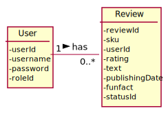
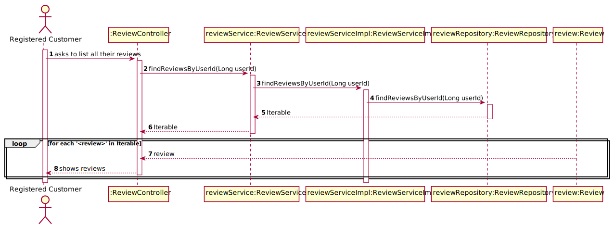
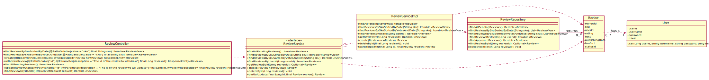

#US08 - To obtain all the user´s reviews

## 1. Requirements Engineering

### 1.1. User Story Description

As  a  user, I  want  to  obtain a list of all my reviews.

### 1.2. Customer Specifications and Clarifications

**From the specifications document:**

> All reviews are created in the pending state by default.

### 1.3. Acceptance Criteria
The user ID must exist and be valid.

### 1.4. Found out Dependencies

* The user must have reviews made.

### 1.5 Input and Output Data

**Input Data:**

* Typed data:
  n/a

* Selected data:
    * reviews

**Output Data:**

* (In)Success of the operation

### 1.6. System Sequence Diagram (SSD)

### 1.7 Other Relevant Remarks

* The created category is ready to be used for tasks' categorization.

## 2. OO Analysis

### 2.1. Relevant Domain Model Excerpt

### 2.2. Other Remarks

n/a

## 3. Design - User Story Realization

## 3.1. Sequence Diagram (SD)

## 3.2. Class Diagram (CD)

**Note: private methods were omitted.**

# 4. Tests

# 5. Integration and Demo

# 6. Observations

n/a