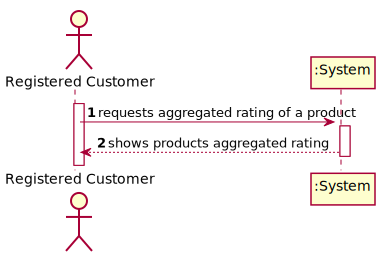
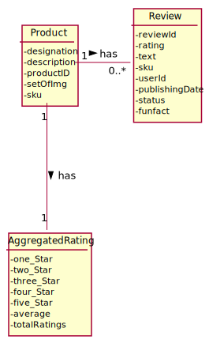
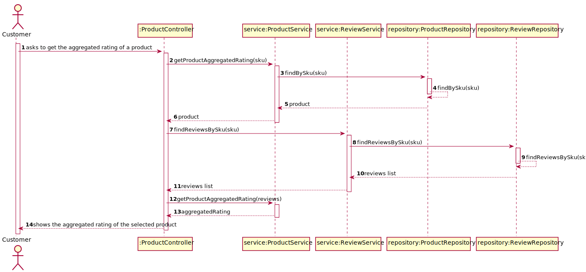
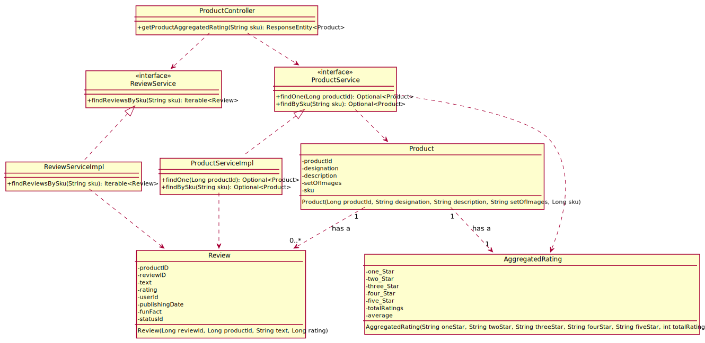

# US 09 - To obtain the aggregated rating of a product

## 1. Requirements Engineering

### 1.1. User Story Description

As anonymous or registered customer I want to obtain the aggregated rating of a product.

### 1.2. Customer Specifications and Clarifications

**From the specifications document:**

> Besides individual reviews and ratings, a product has an aggregated rating based on the weighted average
of all the ratings

**From the client clarifications:**

### 1.3. Acceptance Criteria
* Details of the aggregated rating is in the form of a frequency table (the frequency of
  votes per star).

### 1.4. Found out Dependencies

* There has to be reviews on a given product.

### 1.5 Input and Output Data

**Input Data:**

* Typed data:
  * sku

* Selected data:
  * n/a

**Output Data:**

* aggregated rating 

### 1.6. System Sequence Diagram (SSD)

### 1.7 Other Relevant Remarks

* n/a

## 2. OO Analysis

### 2.1. Relevant Domain Model Excerpt

### 2.2. Other Remarks

n/a

## 3. Design - User Story Realization
### Systematization ##

According to the taken rationale, the conceptual classes promoted to software classes are:

* Product
* Review
* AggregatedRating

Other software classes (i.e. Pure Fabrication) identified:

* ProductController
* ProductServiceImpl
* ReviewServiceImpl

## 3.2. Sequence Diagram (SD)

## 3.3. Class Diagram (CD)

