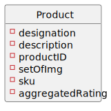
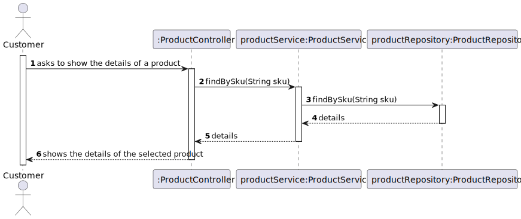
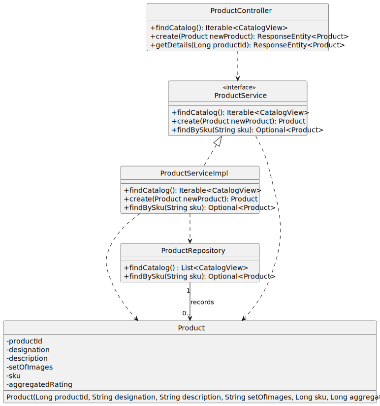

#US02 - To obtain the details of a product

## 1. Requirements Engineering

### 1.1. User Story Description

As  an  anonymous or registered customer, I  want  to obtain the details of a determined product.

### 1.2. Customer Specifications and Clarifications

**From the specifications document:**

> By simplicity, a product comprehends a designation, a description, a productID, a setOfImg and a SKU.

**From the client clarifications:**

>

### 1.3. Acceptance Criteria

*Shows the designation, the description, the productID, a setOfImg and the SKU of the selected product

### 1.4. Found out Dependencies

* The list of products has to be shown first.

### 1.5 Input and Output Data

**Input Data:**

* Typed data:
    * productID

* Selected data:
    * n/a
    
**Output Data:**

* Details of the product(description, a productID, a setOfImg and a SKU)

### 1.7 Other Relevant Remarks

* A product in the list can be chosen to show details(US02).

## 2. OO Analysis

### 2.1. Relevant Domain Model Excerpt

### 2.2. Other Remarks

n/a

## 3. Design - User Story Realization

## 3.1. Sequence Diagram (SD)

## 3.2. Class Diagram (CD)

