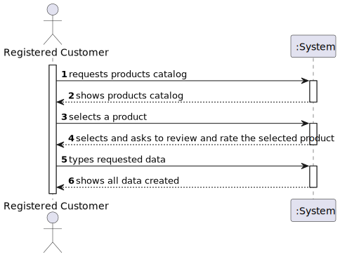
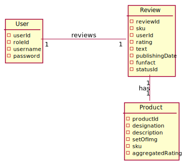
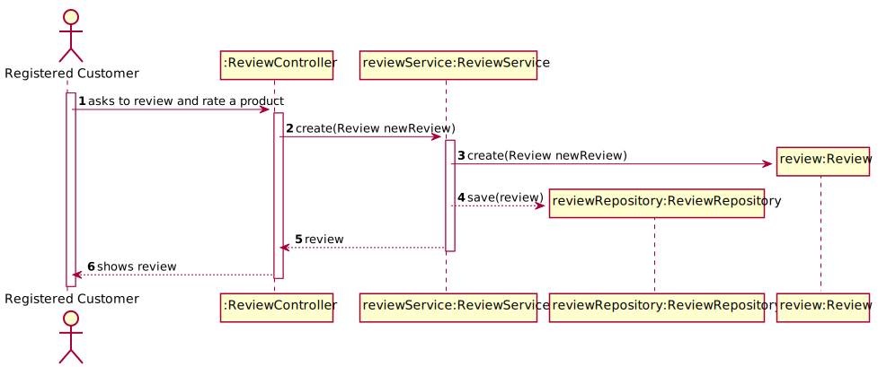
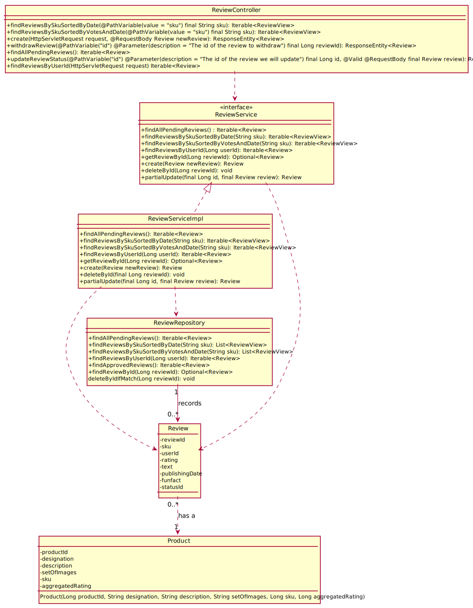

#US04 - To review and rate a product 

## 1. Requirements Engineering

### 1.1. User Story Description

As registered customer I want to review and rate a product.

### 1.2. Customer Specifications and Clarifications

**From the specifications document:**

> By simplicity, a review comprehends a rating, a text, a publishingDate, a reviewId, a productId, a userId, a funFact and a statusId.
> A product comprehends a designation, a description, a productId, a setOfImages and a SKU.

### 1.3. Acceptance Criteria

*n/a

### 1.4. Found out Dependencies

* There has to be products created.

### 1.5 Input and Output Data

**Input Data:**

* Typed data:
    * rating
    * text

* Selected data:
    * product

**Output Data:**

* Created Review

### 1.6. System Sequence Diagram (SSD)

## 2. OO Analysis

### 2.1. Relevant Domain Model Excerpt

## 3. Design - User Story Realization

## 3.1. Sequence Diagram (SD)

## 3.2. Class Diagram (CD)

