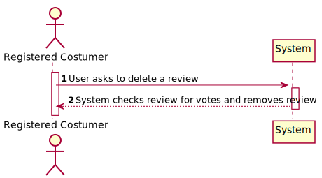
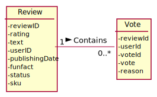
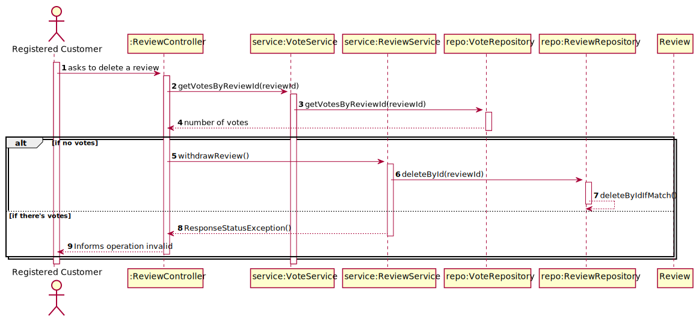
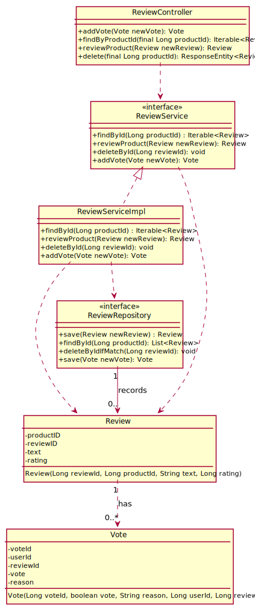

# US 07 - To withdraw a review

## 1. Requirements Engineering

### 1.1. User Story Description

As registered customer I want to withdraw one of my reviews. Only possible if the review has no
votes.

### 1.2. Customer Specifications and Clarifications

**From the specifications document:**

> Users
can also vote for a review if they found it particularly helpful as well as report a review if they consider
such a review is offensive or somewhat misleading

**From the client clarifications:**

### 1.3. Acceptance Criteria
* n/a
### 1.4. Found out Dependencies

* There has to be a review in order to delete it.

### 1.5 Input and Output Data

**Input Data:**

* Typed data:
    * reviewId

* Selected data:
    * n/a

**Output Data:**

* n/a

### 1.6. System Sequence Diagram (SSD)

### 1.7 Other Relevant Remarks

* n/a

## 2. OO Analysis

### 2.1. Relevant Domain Model Excerpt

### 2.2. Other Remarks

n/a

## 3. Design - User Story Realization
### Systematization ##

According to the taken rationale, the conceptual classes promoted to software classes are:

* Review
* Vote

Other software classes (i.e. Pure Fabrication) identified:

* ReviewController
* ReviewService

## 3.2. Sequence Diagram (SD)

## 3.3. Class Diagram (CD)

