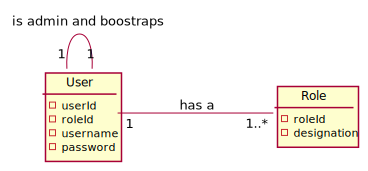
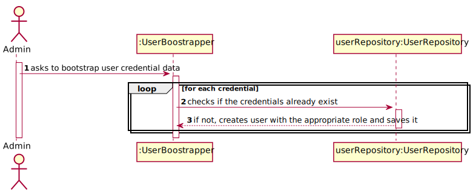
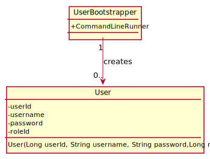

#US012 - To boostrap users

## 1. Requirements Engineering

### 1.1. User Story Description

As  an  admin, I  want  to bootstrap user credential data.

### 1.2. Customer Specifications and Clarifications

**From the specifications document:**

> The roles assigned to each credential are assigned at their creation.

**From the client clarifications:**

### 1.3. Acceptance Criteria

The user must not already exist and the role must be valid.

### 1.4. Found out Dependencies

* The role must exist.

### 1.5 Input and Output Data

**Input Data:**

* Typed data:
  * n/a

* Selected data:
  * n/a

**Output Data:**

* n/a

## 2. OO Analysis

### 2.1. Relevant Domain Model Excerpt

## 3. Design - User Story Realization

## 3.1. Sequence Diagram (SD)

## 3.2. Class Diagram (CD)

