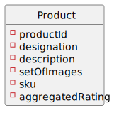
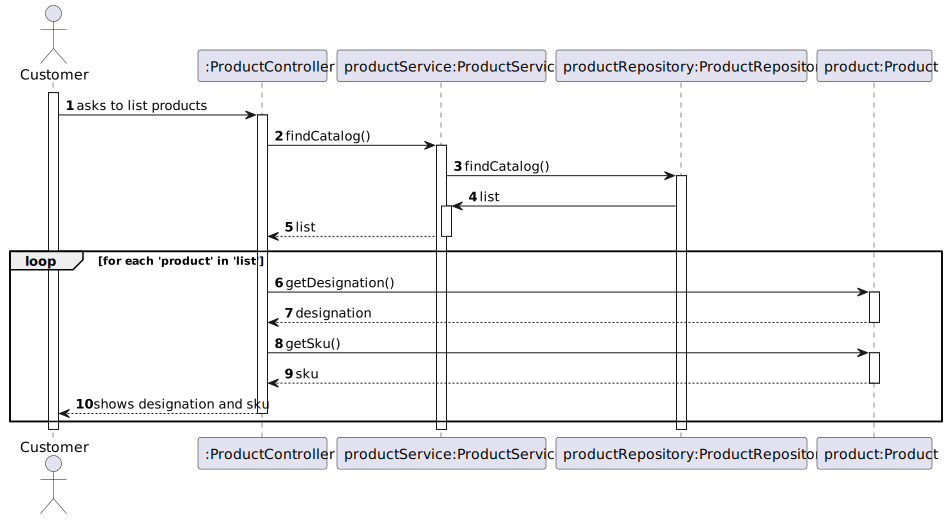
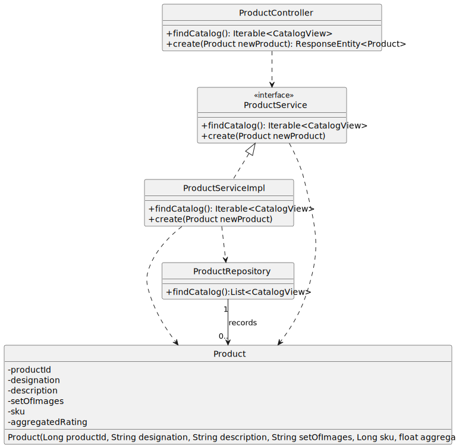

#US01 - To obtain the catalog of products

## 1. Requirements Engineering

### 1.1. User Story Description

As  an  anonymous or registered customer, I  want  to obtain the catalog of products.

### 1.2. Customer Specifications and Clarifications

**From the specifications document:**

> By simplicity, a product just comprehends a designation. If we open the item, it then comprehends a description, a productID, a setOfImg and a SKU. 

**From the client clarifications:**

### 1.3. Acceptance Criteria

*Shows only the designation and SKU of the product.

### 1.4. Found out Dependencies

* At least one product has to be created.

### 1.5 Input and Output Data

**Input Data:**

* Typed data:
    * n/a

* Selected data:
    * n/a

**Output Data:**

* List of products.

### 1.7 Other Relevant Remarks

* A product in the list can be chosen to show details(US02).

## 2. OO Analysis

### 2.1. Relevant Domain Model Excerpt

## 3. Design - User Story Realization

## 3.1. Sequence Diagram (SD)

## 3.2. Class Diagram (CD)

